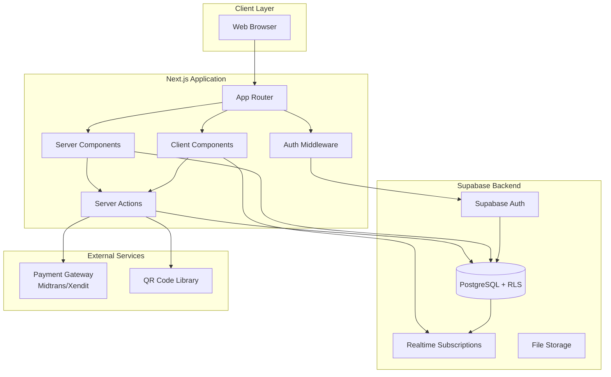

# Design Document: Laundry Management System

## Overview

The Laundry Management System is a full-stack web application built with Next.js 16 (App Router), TypeScript, Tailwind CSS, and Supabase. The system manages laundry business operations with three distinct user roles: Customer (pelanggan), Pegawai (staff), and Owner/Admin. 

The application provides comprehensive features including:
- **Authentication & Authorization**: Role-based access control using Supabase Auth with Row Level Security (RLS)
- **Booking Management**: Customers can book laundry services and reserve washing machines
- **Real-time Tracking**: Live status updates for laundry orders using Supabase Realtime
- **QR Code System**: Automated QR code generation for orders and scanning capability for staff
- **Payment Processing**: Integration with Indonesian payment gateways (Midtrans/Xendit)
- **Staff Management**: Shift scheduling, order assignment, and performance monitoring
- **Business Analytics**: Dashboard with revenue tracking, machine utilization, and operational metrics

The system follows modern Next.js patterns with Server Components for data fetching, Client Components for interactivity, and Server Actions for mutations. All data access is secured through Supabase RLS policies that enforce role-based permissions at the database level.

## Architecture

### High-Level Architecture



### Technology Stack

- **Framework**: Next.js 16.2.6 with App Router
- **Language**: TypeScript 5
- **Styling**: Tailwind CSS 4
- **Backend**: Supabase (PostgreSQL, Auth, Realtime, Storage)
- **Authentication**: Supabase Auth with cookie-based sessions
- **Payment**: Midtrans or Xendit (Indonesian payment gateways)
- **QR Code**: 
  - Generation: `qrcode` or `next-qrcode` library
  - Scanning: `react-qr-scanner` or browser Barcode Detection API
- **State Management**: React hooks + Server State (via Server Components)
- **Real-time**: Supabase Realtime subscriptions

### Deployment Architecture

- **Hosting**: Vercel (recommended for Next.js)
- **Database**: Supabase Cloud (managed PostgreSQL)
- **CDN**: Vercel Edge Network
- **Environment**: 
  - Development: Local Next.js dev server + Supabase project
  - Production: Vercel deployment + Supabase production instance

### Security Architecture

1. **Authentication Layer**: Supabase Auth manages user sessions via HTTP-only cookies
2. **Authorization Layer**: Row Level Security (RLS) policies enforce data access at database level
3. **Middleware Protection**: Next.js middleware validates sessions and protects routes
4. **API Security**: Server Actions validate user roles before database operations
5. **Data Encryption**: HTTPS for transport, Supabase handles encryption at rest

## Components and Interfaces

### Supabase Client Utilities

Based on [Supabase Next.js documentation](https://supabase.com/docs/guides/auth/quickstarts/nextjs), we need three separate client configurations:


#### 1. Server Component Client (`lib/supabase/server.ts`)

```typescript
import { createServerClient } from '@supabase/ssr'
import { cookies } from 'next/headers'

export async function createClient() {
  const cookieStore = await cookies()
  
  return createServerClient(
    process.env.NEXT_PUBLIC_SUPABASE_URL!,
    process.env.NEXT_PUBLIC_SUPABASE_ANON_KEY!,
    {
      cookies: {
        getAll() {
          return cookieStore.getAll()
        },
        setAll(cookiesToSet) {
          cookiesToSet.forEach(({ name, value, options }) => 
            cookieStore.set(name, value, options)
          )
        },
      },
    }
  )
}
```

**Usage**: Server Components, Server Actions, Route Handlers

#### 2. Client Component Client (`lib/supabase/client.ts`)

```typescript
import { createBrowserClient } from '@supabase/ssr'

export function createClient() {
  return createBrowserClient(
    process.env.NEXT_PUBLIC_SUPABASE_URL!,
    process.env.NEXT_PUBLIC_SUPABASE_ANON_KEY!
  )
}
```

**Usage**: Client Components, React hooks


#### 3. Middleware Client (`lib/supabase/middleware.ts`)

```typescript
import { createServerClient } from '@supabase/ssr'
import { NextResponse, type NextRequest } from 'next/server'

export async function updateSession(request: NextRequest) {
  let supabaseResponse = NextResponse.next({
    request,
  })

  const supabase = createServerClient(
    process.env.NEXT_PUBLIC_SUPABASE_URL!,
    process.env.NEXT_PUBLIC_SUPABASE_ANON_KEY!,
    {
      cookies: {
        getAll() {
          return request.cookies.getAll()
        },
        setAll(cookiesToSet) {
          cookiesToSet.forEach(({ name, value, options }) => {
            request.cookies.set(name, value)
            supabaseResponse.cookies.set(name, value, options)
          })
        },
      },
    }
  )

  const { data: { user } } = await supabase.auth.getUser()
  
  return { supabaseResponse, user }
}
```

**Usage**: Next.js middleware for session refresh and route protection

### Core Components

#### Authentication Components

